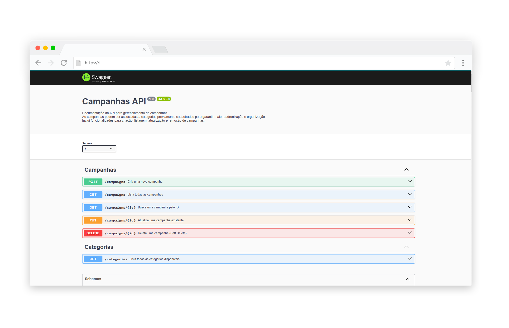
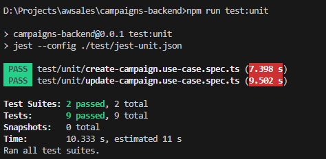
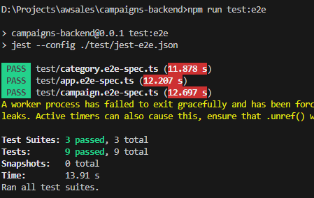

# 📌 Campanhas Backend



## 📖 Descrição

Este é um projeto desenvolvido com o framework **NestJS**, seguindo os princípios da **Clean Architecture** para manter uma estrutura modular e de fácil manutenção.

O sistema permite a criação, edição, listagem e remoção de campanhas vinculadas a categorias. O banco de dados utilizado é gerenciado via **TypeORM** e as configurações do ambiente são gerenciadas via **Docker Compose**.

### 🎯 Escopo

O projeto foi desenvolvido seguindo os requisitos abaixo:

- **ID** (id) - Identificador único da campanha.
- **Nome** (name) - Nome da campanha.
- **Data de Cadastro** (createdAt) - Data e hora da criação da campanha (gerada automaticamente).
- **Data de Início** (startDate) - Data de início da campanha.
- **Data de Fim** (endDate) - Data de término da campanha.
- **Status** (status) - Estado atual da campanha, podendo ser:
  - `ACTIVE` (ativa),
  - `PAUSED` (pausada),
  - `EXPIRED` (expirada).
- **Categoria** (category) - Categoria da campanha, baseada em um conjunto de categorias pré-definidas.

Foram feitas algumas adaptações para padronização, utilizando **nomes em inglês** para as propriedades e **seguindo uma convenção para o banco de dados**.

---

## Referências e Inspirações

- [Clean Architecture](https://github.com/jasontaylordev/CleanArchitecture)
- [The Clean Architecture](https://blog.cleancoder.com/uncle-bob/2012/08/13/the-clean-architecture.html)

## 🚀 Requisitos

Antes de iniciar, certifique-se de ter os seguintes itens instalados:

- [Node.js](https://nodejs.org/) v16+
- [Docker](https://www.docker.com/) e [Docker Compose](https://docs.docker.com/compose/)
- [Git](https://git-scm.com/)

---

## 📦 Instalação

Clone o repositório e instale as dependências do projeto:

```bash
# Clone este repositório
$ git clone https://github.com/talissonjunior16/campaigns-backend.git
$ cd campaigns-backend

# Instale as dependências
$ npm install
```

---

## 🐘 Configuração do Banco de Dados

O banco de dados é gerenciado via **Docker Compose**. Para iniciá-lo, execute:

```bash
# Subir o container do banco de dados
$ docker compose up -d
```

Em seguida, execute as migrações para popular a base de dados:

```bash
# Executar as migrações
$ npm run migration:run
```

Isso garantirá que a tabela de categorias seja populada corretamente.

---

## 🚀 Executando a API

Para rodar a aplicação, utilize:

```bash
# Modo de desenvolvimento
$ npm run start

# Modo de desenvolvimento com hot reload
$ npm run start:dev

# Modo de produção
$ npm run start:prod

# Modo de Debug
$ Aperte F5 no VSCode e aguarde
```

A API estará disponível em:

```
http://localhost:3000
```

A documentação do Swagger pode ser acessada em:

```
http://localhost:3000 OU
http://localhost:3000/docs
```


## 🧪 Executando Testes

O projeto possui testes unitários e testes de integração **(E2E)**. Para executá-los, use:

```bash
# Testes unitários
$ npm run test:unit
```



```bash
# Testes E2E
$ npm run test:e2e
```


---

## 📂 Estrutura do Projeto

O projeto segue a estrutura da **Clean Architecture**, garantindo separação de responsabilidades. Abaixo está um resumo visual da estrutura de pastas:

```
📂 campaigns-backend
├── 📂 src
│   ├── 📂 application (Regras de negócio e casos de uso)
│   │   ├── 📂 campaigns
│   │   │   ├── 📂 dto (Objetos de Transferência de Dados)
│   │   │   ├── 📂 services (Serviços auxiliares)
│   │   │   ├── 📂 use-cases (Casos de uso)
│   │   ├── 📂 categories (Casos de uso das categorias)
│   │   │   ├── 📂 use-cases (Casos de uso)
│   ├── 📂 domain (Entidades, contratos e interfaces)
│   │   ├── 📂 campaigns
│   │   ├── 📂 categories
│   ├── 📂 infrastructure (Infraestrutura, banco de dados e repositórios)
│   │   ├── 📂 database
│   │   │   ├── 📂 migrations (Migrações do banco de dados)
│   │   │   ├── 📂 typeorm (Configuração do TypeORM)
│   ├── 📂 web (Camada de interface e controllers)
│   │   ├── 📂 controllers (Controllers da API)
│   ├── app.module.ts (Módulo principal da aplicação)
│   ├── main.ts (Arquivo principal de inicialização)
│   ├── setup-app.ts (Configuração do app)
├── 📂 test (Testes E2E / Testes Unitários)
├── docker-compose.yml (Configuração do Docker)
├── package.json
├── README.md
```

Cada camada tem uma responsabilidade clara:

- **Application** → Contém a lógica de negócio e casos de uso.
- **Domain** → Define as entidades e interfaces do sistema.
- **Infrastructure** → Implementa repositórios e banco de dados.
- **Web** → Expõe os endpoints via controllers.

---

## 📌 Conclusão

Decidir utilizar uma architecture clean, pois para projetos que precisam escalar
é uma otima opção por mais que o projeto ainda seja pequeno

---
